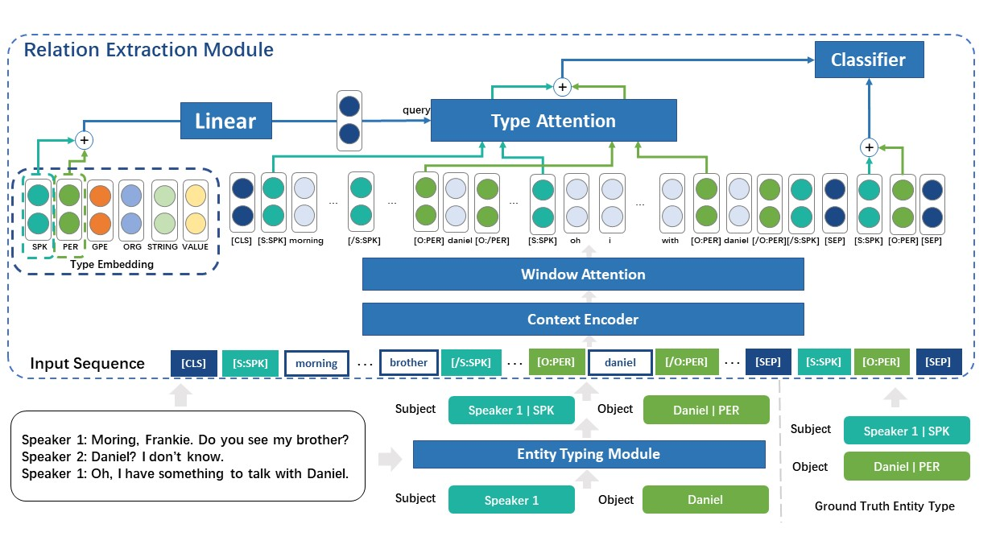

# TypeDRE: A Novel Type-aware Framework for Dialogue-based Relation Extraction

## Overview


We propose a novel type-aware framework, called `TypeDRE`, for dialogue-based relation extraction. `TypeDRE` contains two modules:

1.`Entity typing module`: This module take a piece of dialogue text and entities mentioned in it as input and predict the types of all entities at once.

2.`Relation extraction module`: This module predicts all possible relation between an entity pair according to its type pair that may be predicted from entity tying module or the ground truth.


After preparation, the structure of our program should be: 
```
├─ dataset/: 
    ├─ DialogRE/: the origin data of DialogRE
        ├─ train.json
        ├─ dev.json
        ├─ test.json
    ├─ DialogRE_typed/: save the new test set for inference.
        ├─ test.json
├─ model/: source codes of TypeDRE
├─ pretrained_encoder/: resources of pre-trained models
    ├─ BERT/
        ├─ modeling/
        ├─ bert_config.json
        ├─ pytorch_model.bin
        ├─ vocab.txt
        ├─ convert_tf_checkpoint_to_pytorch_BERT.py
    ├─ RoBERTa/
        ├─ modeling/
        ├─ config.json
        ├─ pytorch_model.bin
        ├─ vocab.json
        ├─ merges.txt
        ├─ convert_roberta_original_pytorch_checkpoint_to_pytorch.py
├─ run_entity_typing.py: code to run entity typing module
├─ run_relation_extraction.py: code to run relation extraction module
├─ generate_typed_data.py: code to construct the new test set for inference
├─ optimization.py
├─ evaluate.py 
├─ README.md
```
## Environments

We conducted our experiments on a Linux server with one GeForce GTX 3080TI.
- python (3.8.12)
- cuda (11.3)

## Dependencies

- torch (1.11.0)
- numpy  
- tqdm
- six
- packaging
- filelock
- regex

## Preparation
### Download the dataset
- Download data from [here](https://github.com/nlpdata/dialogre) 
- Put `train.json`, `dev.json`, `test.json` from ```data_v2/en/data/``` into `dataset/DialogRE/`
### Download the pre-trained language models

#### BERT-base
- Download `uncased_L-12_H-768_A-12.zip` (BERT-Base Uncased) from [here](https://github.com/google-research/bert)
- Unzip it into `pretrained_encoder/BERT/`
- Edit `vocab.txt` and rename `[used0]`~`[used23]` with type markers:
```
[SUBJ-SPK]
[/SUBJ-SPK]
[OBJ-SPK]
[/OBJ-SPK]
[SUBJ-PER]
[/SUBJ-PER]
[OBJ-PER]
[/OBJ-PER]
[SUBJ-GPE]
[/SUBJ-GPE]
[OBJ-GPE]
[/OBJ-GPE]
[SUBJ-ORG]
[/SUBJ-ORG]
[OBJ-ORG]
[/OBJ-ORG]
[SUBJ-STRING]
[/SUBJ-STRING]
[OBJ-STRING]
[/OBJ-STRING]
[SUBJ-VALUE]
[/SUBJ-VALUE]
[OBJ-VALUE]
[/OBJ-VALUE]
```

#### RoBERTa-large
- Download `roberta.large.tar.gz` (RoBERTa-large) from [here](https://github.com/pytorch/fairseq/tree/master/examples/roberta)
- Uzip it into the directory `pretrained_encoder/RoBERTa/`
- Download `merges.txt` and `vocab.json` from [here](https://huggingface.co/roberta-large/tree/main) and put them into `pretrained_encoder/RoBERTa/`

### Convert tensorflow check point to pytorch
- To convert tensorflow check point to `pytorch_model.bin`, prepare an extra environment as follows:
```
python==3.6
tensorflow==1.15
transformers==4.3.3
fairseq==0.10
packaging
```
- In `pretrained_encoder/BERT/`, excute `python convert_tf_checkpoint_to_pytorch_BERT.py --tf_checkpoint_path=bert_model.ckpt --bert_config_file=bert_config.json --pytorch_dump_path=pytorch_model.bin`

- In `pretrained_encoder/RoBERTa/`, excute `python convert_roberta_original_pytorch_checkpoint_to_pytorch.py --roberta_checkpoint_path=. --pytorch_dump_folder_path=.`

# Train&Evaluate&TEST

## Entity typing module

To train and evaluate entity typing module, execute:

```
python run_entity_typing.py \
--do_train --do_eval \
--config_file pretrained_encoder/RoBERTa/config.json \
--vocab_file pretrained_encoder/RoBERTa/vocab.json \
--merges_file pretrained_encoder/RoBERTa/merges.txt \
--init_checkpoint pretrained_encoder/RoBERTa/pytorch_model.bin \
--train_batch_size 12 --gradient_accumulation_steps 6 --learning_rate 5e-6 --num_train_epochs 30.0 \
--output_dir EntityTyping
```

Aruguments:
- `--do_train`: train an entity typing module.
- `--do_eval`: evaluate this module on the dev set and the test set.
- `--output_dir`: the directory of output files.

In output directory `EntityTyping`, the predictions of entity typing module should be saved as a json file (`test_entity_dict.json`). It stores an entity-type dictionary of the test set and will be the input file of relation extraction module.

## Relation extraction module

### process test data
To do inference with the predictions of entity typing module, you need to construct a new test set and can execute:

```python generate_typed_data.py --dict_path EntityTyping/test_entity_dict.json```

The newly-constructed test set will be saved as `test.json` in `dataset/DialogRE_typed`.


Aruguments:
- `--dict_path`: the path of the predicted entity-type dictionary of the test set.

### run module
To train, evaluate and test relation extraction module, you can:

 (a) use `BERT` as encoder and excute:
```
python run_relation_extraction.py \
--do_train --do_eval --do_test \
--encoder_type BERT \
--config_file pretrained_encoder/BERT/bert_config.json \
--vocab_file pretrained_encoder/BERT/vocab.txt \
--init_checkpoint pretrained_encoder/BERT/pytorch_model.bin \
--train_batch_size 24 --gradient_accumulation_steps 4 --learning_rate 3e-5 --num_train_epochs 20.0 \
--layer_num 2 --window_size 7 \
--output_dir Relation_Extraction_BERT
```

 (b) use `RoBERTa` as encoder and excute:
```
python run_relation_extraction.py \
--do_train --do_eval --do_test \
--encoder_type RoBERTa \
--config_file pretrained_encoder/RoBERTa/config.json \
--vocab_file pretrained_encoder/RoBERTa/vocab.json \
--merges_file pretrained_encoder/RoBERTa/merges.txt \
--init_checkpoint pretrained_encoder/RoBERTa/pytorch_model.bin \
--train_batch_size 24 --gradient_accumulation_steps 12 --learning_rate 1e-5 --num_train_epochs 30.0 \
--layer_num 2 --window_size 7 \
--output_dir Relation_Extraction_RoBERTa
```

Aruguments:
- `--do_train`: train a relation extraction module.
- `--do_eval`: evaluate this module on the dev set and the origin test set that use ground truth type information.
- `--do_test`: do inference with the predictions of entity typing module and obtain the real evaluation result.
- `--encoder_type`: choose the type of encoder you use between `BERT` and `RoBERTa`.
- `--config_file`: the configuration file of pretrained encoder.
- `--vocab_file`: the vocabulary file of pretrained encoder. 
- `--merges_file`: the merges file of `RoBERTa`.  
- `--init_checkpoint`: the pretrained parameters of encoder.
- `--layer_num`: the number of window attention layer.  
- `--window_size`: the window size of window attention layer.  
- `--output_dir`: the directory of output files.
